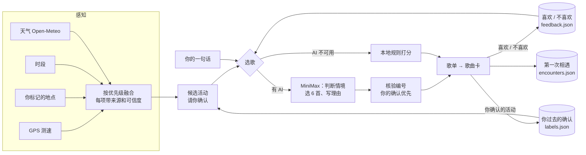

# 情境 DJ（context-dj）

> **先弄清你在做什么，再给你挑歌，并说清为什么挑它。**

[](LICENSE)
[](https://github.com/gosimfoundation/hackathon-agenticapp26)
[](#对照官方评审口径)
[](https://github.com/peterdlick-stack/agentic-app/tree/3345814/bundle)
[](https://github.com/OctoSense-org/OctoScript-App-Design-Flow)

一个 OctoSense 脚本应用（`bundle/main.splash` 一个文件），GOSIM 智能体应用黑客松 2026 音乐场景参赛作品，队伍 KYBER。

[](docs/media/demo.mp4)

## 30 秒看懂

| | |
|---|---|
| **它做什么** | 用 GPS 测速、你标记的地点、时段和天气，推断你此刻在做什么，给出最可能的几个活动让你一键确认；再按**情境 + 你说的一句话 + 你过去的反馈**，由 AI 选 6 首歌并逐首写理由。每首歌有一张**歌曲卡**，记下你和它第一次相遇时的情境 |
| **Agent 做了哪几步** | 读状态（定位、时段、天气、你的历史确认）→ 推断活动并请你确认 → 理解你的话、选歌、写理由 → 核验 AI 的返回 → 按你的喜欢 / 不喜欢更新偏好 → 记录相遇。[详见下文](#一次完整的任务) |
| **你保留哪些控制** | 你的确认永远优先，AI 不能覆盖；每一项情境都写明来源和可信度，可以单独关掉；确认可以撤销；模拟定位、预制内容、AI 解读在界面上都有标注 |
| **出了问题会怎样** | AI 不可用或报错 → 改用本地规则并写明原因；AI 90 秒没回 → 解锁界面、提示再试，迟到的结果作废；没有定位、天气失败 → 该项不参与推荐；启动读文件超时 → 看门狗整步重试并显示原因，不会卡死 |
| **提交版本** | **0.3.3**，提交 [`3345814`](https://github.com/peterdlick-stack/agentic-app/commit/3345814)。应用包在 [`bundle/`](bundle/)，`tools/octo check bundle` 结果 `context-dj 0.3.3 — PASSED`，摘要 `32e193e7…` |
| **在哪里跑过** | OctoSense 桌面版（Linux / WSL，接赛方 MiniMax）：完整流程含真实 AI 选歌；`card-host`（Linux + Xvfb）：全部界面和失败路径。手机未验证，[见验证情况](#验证情况) |
| **怎么跑** | [运行与复现](#运行与复现)：读源码 → 门禁检查 → `card-host` 运行 → 桌面版完整体验 |

## 目录

- [演示视频与截图](#演示视频与截图)
- [一次完整的任务](#一次完整的任务)
- [对照官方评审口径](#对照官方评审口径)
- [它不做什么](#它不做什么)
- [设计依据](#设计依据)
- [它是怎么工作的](#它是怎么工作的)
- [平台限制与我们的对策](#平台限制与我们的对策)
- [数据来源、权限与隐私](#数据来源权限与隐私)
- [运行与复现](#运行与复现)
- [验证情况](#验证情况)
- [仓库结构](#仓库结构)
- [AI 协作说明](#ai-协作说明)
- [作者、支持与许可](#作者支持与许可)

## 演示视频与截图

**[▶ 观看演示视频 docs/media/demo.mp4](docs/media/demo.mp4)**（2 分 38 秒，1080×1920 竖屏，带字幕，无配音，3.2 MB）

在 OctoSense 桌面版（应用 0.3.3）里一镜到底录制：从主界面确认情境 → 说一句“想听点甜的，最好是洛天依” → **MiniMax 当场选歌**（真实等待约 12 秒，没有剪辑、没有加速）→ 进入《I LOVE U》歌曲卡，看封面、故事页、点喜欢后的相遇页 → 回到歌单。桌面没有 GPS，演示用模拟定位“步行”，界面上的橙色提示和“测试数据”标注全程保留。为避免版权问题，跳过歌词页，录像里不出现歌词。

| AI 按情境和一句话选歌 | 歌曲卡 |
|---|---|
|  |  |

| ① 情境与候选活动 | 故事页：事实带出处，解读单独标注 | 相遇页：初见与心动 |
|---|---|---|
|  |  |  |

以上都出自上面这次录制。**失败和空状态**（在 `card-host` 里截取，0.3.3）：

| 没有定位、天气服务不可用 | AI 不可用时退回本地规则 |
|---|---|
|  |  |

- 没有 GPS 信号时，移动状态显示“没有定位”；天气请求失败时显示“不可用 · 不参与”，不参与推荐，其余功能照常。
- AI 服务不可用时，改用本地规则选歌，并在歌单上方写明原因，以及本地规则从你的话里听懂了什么。

截图和录像里出现的官方封面只用于演示，原图不在仓库里。

## 一次完整的任务

以演示视频里的这一次为例（工作日傍晚，模拟定位“步行”）：

| # | 谁 | 做什么 | 结果怎么核对 |
|---|---|---|---|
| 1 | 应用 | 读取时段、天气（Open-Meteo）、移动状态（GPS 测速）、是否在你标记的地点，并按你过去的确认算出候选活动 | 情境卡上每一项都写明来源和可信度；模拟定位时顶部一直显示橙色提示 |
| 2 | 你 | 应用猜的是“通勤”，你点了“散步”**纠正**它 | 写入 `labels.json`；改选会替换刚才那条，不会多记 |
| 3 | 你 | 补一句“想听点甜的，最好是洛天依” | — |
| 4 | AI（MiniMax） | 拿到文字形式的情境（不含坐标）、你的话、候选歌和你的喜好分，按固定 JSON 格式**先判断你在做什么，再选 6 首歌并写理由** | 应用检查返回的编号是否合法；你确认的“散步”不会被 AI 改掉；歌单上方显示“AI 理解”，你能看出它是怎么理解的 |
| 5 | 应用 | AI 报错时改用本地规则；90 秒内没返回就判超时、解锁界面请你再试，超时后才到的结果作废，不会覆盖你之后的操作 | 界面写明这次用的是 AI 还是本地规则，以及原因 |
| 6 | 应用 | 6 首歌第一次出现在歌单里，各记一条“初见” | `encounters.json`，不含坐标；歌曲卡第 4 页可见 |
| 7 | 你 | 进入《I LOVE U》歌曲卡，点“喜欢” | 反馈同时写入总体分和“散步”下的分；第 4 页出现“心动”；回到歌单，这一行出现心形 |
| 8 | 下一次 | 同样的情境下，这首歌排得更靠前；在某个活动下点了“不喜欢”的歌，在这个活动下基本不会再出现 | 重启后反馈、确认、相遇记录都保留 |

## 对照官方评审口径

官方音乐场景的要求是“围绕专注、通勤等情境组织播放任务，让选择、操作与播放状态相连”；最佳 Agentic 奖看任务完成、可靠运行、人机协作三条。

| 评审口径 | 情境 DJ 的做法 | 证据 |
|---|---|---|
| **任务完成**：从真实输入到执行与结果核验 | 真实输入是定位、时段、天气和你的一句话；执行是推断活动、选歌、写理由；核验是检查 AI 返回的编号、写明每项依据，并用你的反馈和相遇记录闭环 | 演示视频；[一次完整的任务](#一次完整的任务) |
| **可靠运行**：状态变化、失败恢复、重复测试 | 移动状态要连续两次一致才切换；手动活动 90 分钟后失效；AI 报错退回本地规则，90 秒没回就解锁并提示重试，迟到结果作废；启动看门狗 1 秒没进展就整步重试并显示原因；每个处理函数最多一次文件读写，避开平台 64 ms 墙钟上限 | [验证情况](#验证情况)；`docs/PLAN.md` 第 14、15 节的故障注入测试 |
| **人机协作**：来源可查、授权清楚、操作有反馈、用户能调整与接管 | 每项情境写来源和可信度、可单独关掉；你的确认优先于推断和 AI；确认可撤销；故事页事实逐条标出处，解读标“AI 整理，可能不准”；权限逐项说明用途 | 截图；[数据来源、权限与隐私](#数据来源权限与隐私)；[PRIVACY.md](PRIVACY.md) |
| **区分练习数据、概念展示与真实服务** | 模拟定位全程橙色提示，记录里标 `sim: true`，之后被真实记录替换；歌曲故事是预制的，界面标“预制内容”；演示数据页顶部标“演示数据” | 截图 ①、故事页、相遇页 |
| **选择、操作与播放状态相连** | 选择（确认活动、说一句话）→ 操作（喜欢 / 不喜欢 / 去听）→ 记录（初见、第一次去听、心动），下一次推荐会用到。**应用本身不能播放音频**，“去听”在应用内网页打开音乐网站的搜索页 | [它不做什么](#它不做什么) |

## 它不做什么

- **不播放音频，也不知道你是否真的在听**。OctoSense 脚本应用没有音频接口，“去听”只打开网易云音乐、QQ 音乐或 B 站的搜索页；所以第 4 页写的是“第一次去听”，不是“初听”，歌词也只能静态显示，不做跟唱。
- **不存坐标**。定位点只在内存里保留 2 分钟；所有记录只存地点类型（家、学校……）。
- **不读相册**。歌曲卡封面背面只能放你自己的照片，目前要手动放进应用存储。
- **不替你下结论**。AI 的判断和你的确认冲突时，按你的确认来；推测出来的情境明确标“推测”。
- **不编造歌曲故事**。没有出处的内容不写成事实；找不到创作缘起就写“本次核查没有找到”。
- **仓库里没有歌词、官方封面和用户照片**（仓库公开，有版权问题）。

## 设计依据

| 论文 | 在应用里对应什么 |
|---|---|
| Context-Aware Mobile Music Recommendation for Daily Activities（2012） | 按活动定目标能量，歌曲带能量、人声、情绪标签 |
| Smart-DJ（2016） | 按情境记住的个人偏好：同一首歌在“学习”和“运动”下的喜好分开记 |
| ExtraSensory（2017） | 多传感器融合推断情境的思路。平台不开放加速度计，所以改用 GPS 速度、地点、时段、天气融合，并给出可信度 |
| ContextPlay（2019） | 情境卡上每一项都写明来源，可以分别关掉；手动活动 90 分钟后失效；推测出来的明确标“推测” |
| LLM 对话式音乐推荐的用户体验（2025）、Read Between the Tracks（2026） | 用一句话说意图，由 AI（`model.complete`）理解意图、选歌、写理由，并显示它是怎么理解的 |

## 它是怎么工作的



1. **情境感知**：
   - GPS 每 10 秒采样一次，用近 60 秒的净位移估计速度，分为静止、步行、跑步或骑行、乘车四档。精度差于 50 m 的点丢弃，状态要连续两次一致才切换。
   - 你在“感知”页标记的家、学校、公司、健身房：在 200 m 以内且静止时，算作“在那儿”。
   - 时段来自设备时钟；天气来自 Open-Meteo，有定位时按当前位置查询。
   - 按优先级融合成当前活动：手动 > 你话里说明的情境 > 地点 > 移动 > 时段。每一步都写明依据和可信度。
2. **规律和候选（v0.3）**：
   - 你每次点选或说明的活动，都记成一条“真实标签”（`labels.json`，最多 500 条，不含坐标）。只有你自己的确认才记，自动推断不记，避免模型自己强化自己。
   - 按情境桶（工作日或周末 × 时段 × 地点类型 × 移动状态）统计：P(活动 | 桶) = (该桶里选它的次数 + 3 × 先验) / (该桶总次数 + 3)。先验来自上面的规则推断；桶里不足 3 条时退回到“工作日或周末 × 时段”。
   - 主界面是三张卡片，点选后自动进入下一张：① 你在做什么（候选活动做成大按钮，最可能的那个高亮；点一个就是确认，写入 `labels.json`；也可以“不确定，先按推断继续”，不记确认）→ ② 有什么要求（6 个常用要求一点即选歌，或自己写一句）→ ③ 歌单。顶部的小标签和左上角「‹」可以回到前面的步骤；回 ① 改选活动会替换刚才那条确认，不会多记。
3. **选歌**：
   - 设备给本应用开放了 AI（`model` 权限）时，把文字形式的情境信号（不含坐标）、意图、候选歌和你的喜好分交给 AI，让它按固定格式（JSON Schema）**先判断你在做什么，再选 6 首歌并写理由**。应用会检查返回的编号是否合法；你手动选的或话里说明的情境不会被 AI 覆盖。AI 90 秒没有返回时，界面解锁并提示再试一次，超时后才到的结果作废。
   - AI 不可用时，用本地规则打分：能量与活动的距离、是否人声、情绪、语种、你的反馈、“换一批”。界面会写明这次用的是哪种方式，以及本地规则从你的话里认出了哪些关键词。
   - 能量和情绪只是内部打分字段，界面上用“安静 / 舒缓 / 适中 / 轻快 / 激烈”这样的文字描述，不显示意义不明的数字。
4. **反馈**：在歌曲卡里点喜欢 / 不喜欢，会同时改变这首歌的总体分和当前活动下的分（范围 -3 到 3）。点“不喜欢”后自动切到下一首。
5. **播放**：“去听”在应用内网页打开网易云音乐、QQ 音乐或 B 站的搜索页，做法和系统自带的 YouTube 应用一样。
6. **第一次相遇（v0.3）**：每首歌第一次出现在歌单里（初见）、第一次点“去听”、第一次点“喜欢”（心动）时，记下当时的时段、活动、地点类型、移动状态和天气（`encounters.json`，不含坐标）。每个时刻只记第一次；模拟定位下的记录会被之后的真实记录替换。
7. **歌曲卡（Demo：《I LOVE U》）**：在歌单或曲库里点一首歌，进入一张可以左右滑动（或点页码圆点）的四页卡片，下方固定一排控制栏（上一首、不喜欢、去听、喜欢、下一首），切歌按进来的那个列表计数，左上角「‹」回到原列表。
   - ① 封面：有你自己的照片时，点封面可以翻到照片，并标注「你的照片」；没有封面图时显示静态唱片造型
   - ② 歌词：静态全文，可以上下滚动
   - ③ 故事和档案：**事实逐条标出处，解读单独成段并标明“AI 整理，可能不准”**；Demo 里的故事是预制的，界面上标为预制
   - ④ 你和这首歌：初见、第一次去听、心动三个时刻的时间线和统计；模拟定位产生的记录标“测试数据”
   - 没有卡片内容的歌，第 2、3 页显示空状态，第 1、4 页照常显示。目前只有《I LOVE U》有完整卡片内容
8. **应用助手**：manifest 里声明了一个只读的 agent，见 [`bundle/AGENT.md`](bundle/AGENT.md)。在 OctoSense 的 “Ask 情境 DJ” 面板里，它可以根据本地的推荐历史、反馈、确认记录和相遇记录回答“我学习时喜欢听什么”“我的规律是什么”之类的问题，不能修改任何数据。

完整设计、接口和阈值见 [docs/PLAN.md](docs/PLAN.md)（第 2 节 v0.2，第 9–15 节 v0.3），歌曲卡见 [docs/DEMO-ILOVEU.md](docs/DEMO-ILOVEU.md)。

## 平台限制与我们的对策

这些都是开发中实际碰到、并在 `card-host` 或桌面版里实测过的：

| 平台限制 | 影响 | 对策 |
|---|---|---|
| 不开放加速度计等传感器，只有 GPS | 不能像 ExtraSensory 那样用多传感器识别活动 | 用 GPS 净位移测速 + 地点 + 时段 + 天气融合，并给出可信度；没把握时请你确认 |
| 每个处理函数最多 20 万条指令 | 500 条确认记录一次性读入会超限 | 启动分批加载（`run_chunks`），实测 500 条确认 + 1000 条相遇记录能正常启动 |
| 每个处理函数还有 64 ms 墙钟上限 | 慢盘上（WSL 访问 Windows 磁盘）启动会卡在“正在加载…” | 每个处理函数最多一次文件读写；启动看门狗整步重试并显示原因；启动完成前不写会增长的文件 |
| 脚本应用没有音频播放接口 | 没有进度条，歌词不能跟唱 | “去听”打开音乐网站搜索页；歌词静态显示 |
| 没有文件选择器，不能读相册 | 用户不能选照片作封面背面 | 暂时手动放入应用存储；已整理一份“只读单张图片选择器”的需求，准备提给平台 |
| `model.complete` 只返回文字 | 不能在应用内生成封面图 | 砍掉 AI 封面，只用官方封面和用户照片 |
| Linux 桌面上 makepad 没有实现内置网页 | Linux 上“去听”打不开 | 如实标为未验证，待在 Android 或 macOS 上验证 |

## 数据来源、权限与隐私

| 数据 | 来源 | 限制 |
|---|---|---|
| 移动状态、地点 | 设备 GPS（`location` 权限）；你在“感知”页标记的地点 | 桌面没有 GPS，演示和截图用模拟定位，界面全程标注；记录里不存坐标 |
| 时段 | 设备时钟 | — |
| 天气 | [Open-Meteo](https://open-meteo.com/)（`api.open-meteo.com`） | 断网或服务出错时不参与推荐 |
| AI 理解与选歌 | OctoSense 提供的 `model` 服务，比赛中为赛方提供的 MiniMax | 只返回文字；不可用时退回本地规则 |
| 曲库 | 内置 46 首，能量、人声、情绪、语种为人工粗标 | 不是测量值；可以添加自己的歌，并让 AI 补标签（标明是 AI 推断） |
| 歌曲故事（《I LOVE U》） | B 站投稿页与简介、作者 2015 年采访、萌娘百科，每条事实在界面上标出处 | 解读为预制内容，标“AI 整理，可能不准”；目前只有这一首有完整卡片 |
| 歌词、官方封面、用户照片 | 只放在本机应用存储 | 不进仓库，clone 后运行时这些页显示空状态 |

**权限**（[`bundle/manifest.json`](bundle/manifest.json)）：

| 权限 | 用来做什么 | 没有这项权限时 |
|---|---|---|
| `storage` | 偏好、反馈、曲库、推荐历史、确认记录、相遇记录（上限 16 MiB） | — |
| `location` | 估计移动速度、判断是否在你标记的地点附近；查当地天气 | 移动状态显示“没有定位”，不参与推荐 |
| `net`（只有 `api.open-meteo.com`） | 当前天气 | 天气显示“不可用”，不参与推荐 |
| `model` | AI 理解情境、选歌、写理由、补标签 | 改用本地规则选歌，界面写明原因；补标签提示没有 AI 权限 |
| `web` | “去听”在应用内打开音乐网站搜索页 | — |

应用助手是只读的（`profile: read-only`）。应用和仓库里都没有任何 API 密钥，AI 由 OctoSense 平台代为调用。完整说明见 [PRIVACY.md](PRIVACY.md)。

## 运行与复现

按需求从轻到重，有四条路：

**① 只读源码**（不需要构建）：全部逻辑在 [`bundle/main.splash`](bundle/main.splash)（约 2500 行）。配套阅读 [`docs/PLAN.md`](docs/PLAN.md)（设计和每一轮测试记录）和 [`AGENTS.md`](AGENTS.md)（实测踩过的坑）。

**② 门禁检查**：需要按 [OctoScript-App-Design-Flow 的 QUICKSTART](https://github.com/OctoSense-org/OctoScript-App-Design-Flow/blob/main/docs/QUICKSTART.md) 准备好 `tools/octo`（它在那个仓库里，不在本仓库）。

```sh
OCTO=<OctoScript-App-Design-Flow 路径>/tools/octo
git clone https://github.com/peterdlick-stack/agentic-app && cd agentic-app
git checkout 3345814    # 0.3.3，初赛提交版本
$OCTO check bundle        # 期望：context-dj 0.3.3 — PASSED
```

**③ 在 `card-host` 里运行**（全部界面、模拟定位、失败路径）：

```sh
$OCTO run bundle --port 8141 --detach
$OCTO shot 8141 out.png               # 截图
curl -s 127.0.0.1:8141/quit           # 退出
```

`card-host` 里没有 `model` 服务、没有 GPS、Linux 上没有内置网页，所以会走“AI 不可用 → 本地规则”，定位要在“感知”页打开模拟定位。这些都是预期行为。

**④ 在 OctoSense 桌面版里完整体验**（真实 AI 选歌）：按 [PUBLISHING](https://github.com/OctoSense-org/OctoScript-App-Design-Flow/blob/main/docs/PUBLISHING.md) 把 `bundle/` 签名后发布到本地 App Hub 目录，在桌面版的 App Hub 里安装并打开；AI 提供方在桌面版的 AI 设置里配置。

**可选：放入歌曲卡内容**。clone 下来的应用里，《I LOVE U》的歌词页和故事页是空状态。要看完整卡片，把下面三个文件放进应用存储目录（格式见 [docs/DEMO-ILOVEU.md](docs/DEMO-ILOVEU.md) 第 4 节）：`accounts/device/cards.json`、`lyrics/iloveu.txt`、`covers/iloveu-front.jpg`。

**排障**

- **一直停在“正在加载…”或反复显示“读取××超时”**：应用数据目录放在了很慢的盘上（例如 WSL 里的 `/mnt/c`、`/mnt/f`）。0.3.0 起看门狗会重试并显示原因；仍然进不去时，把 `OCTOSENSE_APP_DATA` 改到 WSL 自己的 ext4 目录。
- **歌单上方写着“AI 不可用”**：当前宿主没有 `model` 服务（`card-host` 必然如此），或者 AI 设置没配好。本地规则照常工作。
- **点“去听”没反应**：Linux 桌面上 makepad 还没实现内置网页，属于平台限制。

## 验证情况

| 项目 | 状态 | 在哪里验证 |
|---|---|---|
| 门禁检查 `context-dj 0.3.3 — PASSED` | ✅ | 干净检出 |
| 三步主界面、候选确认与撤销、去重 | ✅ | `card-host` + 桌面版 |
| 真实 MiniMax：情境判断 + 选歌 + 理由 | ✅ | 桌面版（v0.2 的 5 个场景、彩排 18 次请求、正式录制） |
| AI 不可用退回本地规则；选歌途中出错不卡死 | ✅ | `card-host`（无 model 服务、故障注入） |
| 歌曲卡四页、空状态、喜欢后列表同步 | ✅ | `card-host` + 桌面版（页码圆点） |
| 第一次相遇：只记第一次、模拟记录被替换、不含坐标 | ✅ | `card-host` |
| 启动看门狗、慢盘启动、故障注入 | ✅ | `card-host` 故障注入 + 桌面版放在 `/mnt/f` |
| 重启后数据全部保留 | ✅ | `card-host` + 桌面版 |
| 仓库里没有歌词、封面、照片 | ✅ | `git ls-files` |
| 桌面上用鼠标横拖翻页 | ❌ 未通过 | 桌面版（远程桥拖动未触发翻页，页码圆点可用） |
| 真实 MiniMax 下迟到结果被作废 | ⏳ 未验证 | `card-host` 没有 model 服务 |
| 真机 GPS、触屏滑动、手机上的 AI | ⏳ 未验证 | 还没有把商店应用装到手机上的途径 |
| “去听”在应用内打开网页 | ⏳ 未验证 | Linux 桌面不支持，要在 Android 或 macOS 上验证 |
| 应用助手面板 | ⏳ 未验证 | — |
| 用真实照片翻面、封面连续旋转 | ⏳ 未验证 | 照片翻面只用合成测试图验证过 |

**已知问题**：推荐理由偏直白，演示里那次基本复述了用户的话（“用户指定的洛天依甜歌，直接安排”），下一步要改提示词。内置 46 首歌的标签是人工粗标的。

<details>
<summary><b>逐轮验证记录（按时间倒序）</b></summary>

**演示录制与 0.3.1–0.3.3（2026-10-06）**：
- 0.3.1：选歌超时从 45 秒放宽到 90 秒（彩排 18 次真实 MiniMax 请求里，6 次在 45 秒处被判超时，成功的请求有 41、43 秒才返回的）。
- 0.3.2 / 0.3.3：歌曲卡第 1 页在 432×768 窗口下歌名被裁掉一半，改为可滚动并缩小封面区；封面改为整图等比显示、不裁切。`card-host` 432×736 下实测封面四边、歌名、歌手完整，干净检出后 `tools/octo check bundle` 为 `context-dj 0.3.3 — PASSED`。
- 演示视频在 OctoSense 桌面版 0.3.3、独立测试数据目录里录制，真实 MiniMax 请求 1 次，《I LOVE U》排第 1。逐帧检查：全片没有出现歌词页；模拟定位提示、“测试数据”、“预制内容”、“AI 整理，可能不准”都可见。

**三步卡片与统一配色（G12，2026-10-06 合并）**：GPT 在 `card-host` 和隔离的桌面版实例里跑过 DEMO-ILOVEU 第 6 节的 T1–T14、N1–N10（桌面版真实 MiniMax 选歌通过；桌面鼠标横拖翻页未通过，页码圆点可用）。合并前 Claude 修了两处并在 `card-host` 里做了对照测试（见 docs/PLAN.md 第 15 节）：选歌途中出错不再让界面永久卡在“正在选歌”；重复确认同一活动不再多记一条。之后在桌面版、`/mnt/f` 慢盘上复测通过（重启时 ① 显示“读取偏好超时，第 1…3 次重试”，之后恢复）。

**歌曲卡合并验收（2026-10-06，OctoSense Linux 桌面版）**：使用独立 WSL ext4 测试数据目录，未使用日常数据目录。实际观察并核验了：

- `tools/octo check bundle` 为 `context-dj 0.3.0 — PASSED`；冷启动完成，没有停在“正在加载…”。
- 沿用已配置的 MiniMax 服务，输入“上午在工作，想听舒缓的纯音乐”，真实 AI 返回 6 首歌，界面显示 AI 理解与理由；历史 `how=AI`、`ai_raw.activity=work`，并生成 6 条初见记录。
- 从歌单第一首 Gymnopédie No.1 进入歌曲卡，通过页码圆点依次查看四页，再返回原歌单；该曲没有预置封面、歌词、故事，空状态正常，第 4 页显示本次生成的初见情境。
- 正常退出并重启后，界面恢复“上次的歌单”，该测试应用目录内文件的 SHA-256 与重启前全部一致。
- 实际看到 Open-Meteo 返回“北京 晴 22°C”；`git ls-files` 中没有歌词、歌曲封面或用户照片，原有图标和 UI 截图保留。

本轮边界：桌面宿主的 remote bridge 鼠标拖动没有触发翻页，本轮四页使用页码圆点验证；不宣称桌面拖动通过。没有验证手机触摸、真实 GPS、个人照片或实际音频播放，也没有重跑全部桌面 T11/T12。此前 card-host 滑动结果不替代这些验证。

**歌曲卡（2026-10-06，`card-host`）**：通过 remote bridge 真实点击，DEMO-ILOVEU 第 6 节的 T1–T10、T13、T14 通过（T4 的照片翻面用的是合成测试图）；鼠标下左右翻页和上下滚动互不干扰；仓库里没有歌词、封面、照片文件。

**v0.3（2026-10-05，`card-host`）**：Linux + Xvfb 隐藏窗口，全部通过 remote bridge 真实点击：
- 候选卡：显示前 3 个候选和概率，点一下确认、再点取消；确认记录写入 `labels.json`。500 条确认记录加 1000 首歌的相遇记录同时启动，分批加载没有超过指令上限
- 第一次相遇（docs/PLAN.md 第 13 节）：初见、初听、心动各只记第一次，重启后不变；模拟定位下的记录会被之后的真实记录替换；记录里没有坐标；格式不完整的旧记录能正常读入
- 启动加固（docs/PLAN.md 第 14 节）：在临时副本里让某一步超时（故障注入），看门狗整步重试，界面显示原因，不再无声卡住
- `tools/octo check bundle` 的结果为 `context-dj 0.3.0 — PASSED`

**v0.2**：Linux（Ubuntu 24.04，Xvfb）+ App Hub `card-host` 隐藏窗口，所有操作都通过 remote bridge 真实点击和输入完成。docs/PLAN.md 第 4 节的 T1–T10 全部通过：
- 用模拟定位测了静止、步行、骑行、公交，状态切换有两次确认，不会来回跳
- 地点推断、手动覆盖、从话里识别情境
- 反馈按活动分开记
- 重启后的持久化，以及历史里不含坐标
- 0.1 版数据的迁移
- 真实 MiniMax 上的 AI 选歌和情境判断：在 OctoSense 桌面版里验证过 5 个场景（docs/PLAN.md 第 12 节）

**v0.1 起**：
- 首次启动；选择活动；输入意图后推荐；喜欢和不喜欢写入 `feedback.json`；重启后反馈仍然影响排序（喜欢过的升到第一，不喜欢的消失）
- 换一批；添加和删除自己的歌；断网时天气显示“不可用”、不参与推荐，其余功能照常
- `card-host` 不提供 `model` 服务，所以每次都走了“AI 不可用 → 本地规则”这条路，并显示了原因

</details>

## 仓库结构

```
agentic-app/
├─ bundle/                 应用包，唯一提交给 App Hub 的部分
│  ├─ main.splash          全部应用逻辑和界面
│  ├─ manifest.json        身份、版本、权限、摘要
│  ├─ listing.json         商店资料：描述、分类、截图、隐私政策
│  ├─ AGENT.md             只读应用助手的说明
│  ├─ assets/icon.svg
│  └─ screenshots/         商店截图
├─ docs/
│  ├─ PLAN.md              设计、接口、阈值和每一轮测试记录
│  ├─ DEMO-ILOVEU.md       歌曲卡的设计规格、数据格式和验收用例
│  └─ media/               演示视频和 README 截图
├─ AGENTS.md               开发约定和实测踩过的坑（CLAUDE.md、GEMINI.md 只是引用它）
├─ BRIEF.md                v0.1 的原始需求
├─ PRIVACY.md              隐私说明
└─ LICENSE                 Apache-2.0
```

## AI 协作说明

这个项目由人和多个 AI Agent 分工完成：

- **Fano（作者）**：选题、需求和设计取舍、每一步的验收，以及所有需要人工完成的步骤（密钥、发布、提交）。
- **Claude（Anthropic）**：应用代码 `bundle/main.splash`、界面设计、歌曲卡文案、技术文档，审查和合并 GPT 的改动，在 `card-host` 里做回归测试。
- **GPT（OpenAI Codex）**：在作者电脑上部署 OctoSense 桌面版、跑真实 MiniMax 的测试、核实歌曲资料、实现歌曲卡初版、按分镜录制演示视频并逐帧核对。

各 Agent 的任务书和测试报告留在作者本机，不放进仓库；仓库里的提交记录保留了每次改动的作者。应用自身的 Agent（选歌、情境判断、只读应用助手）使用平台的 `model` 服务。

## 作者、支持与许可

- 队伍：KYBER ｜ 作者：Fano（[@peterdlick-stack](https://github.com/peterdlick-stack)）
- 问题和建议：[GitHub Issues](https://github.com/peterdlick-stack/agentic-app/issues)
- 许可：[Apache-2.0](LICENSE)。演示中出现的《I LOVE U》（作词 苍十三，作曲、编曲 阿良良木健，演唱 洛天依，曲绘 历历路路）官方封面只用于演示，版权归原作者，不在仓库里。
