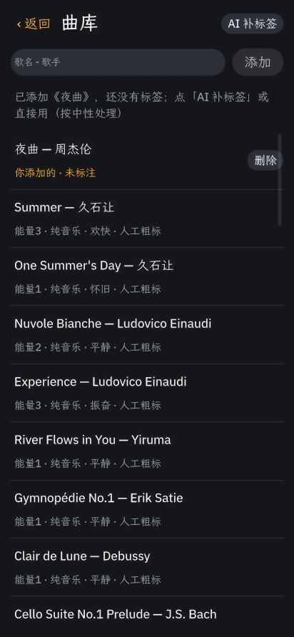

# 情境 DJ（context-dj）

一个 OctoSense 脚本应用（`bundle/main.splash`），参加 GOSIM 智能体应用黑客松 2026 的音乐赛道。

用一句话说你现在想听什么，比如"写代码，不要人声"。它结合**此刻的情境**（时段、天气、手动选的活动）和**你过去的反馈**挑一组歌，并逐首说明为什么选它。你点"喜欢"或"不喜欢"，下次在同一个活动下它就会多推或少推这首。

| 主页 | 曲库 |
|---|---|
|  |  |

## 设计依据

| 论文 | 在应用里对应什么 |
|---|---|
| Context-Aware Mobile Music Recommendation for Daily Activities（2012） | 按活动定目标能量，歌曲带能量、人声、情绪标签 |
| Smart-DJ（2016） | 按情境记住的个人偏好：同一首歌在"学习"和"运动"下的喜好分开记 |
| ExtraSensory（2017） | 设计参考。平台不开放加速度计等传感器，所以不做自动识别活动，改为手动选择加时段推测 |
| ContextPlay（2019） | 情境卡上每一项都写明来源，可以分别关掉；手动活动 90 分钟后失效；推测出来的明确标"推测" |
| LLM 对话式音乐推荐的用户体验（2025）、Read Between the Tracks（2026） | 用一句话说意图，由 AI（`model.complete`）理解意图、选歌、写理由，并显示它是怎么理解的 |

## 它是怎么工作的

1. **情境**：时段来自设备时钟（拿到天气后用 Open-Meteo 返回的 UTC 偏移，否则按 UTC+8）；天气来自 Open-Meteo；活动由你手动选，没选时按时段推测。
2. **意图**：输入框里的一句话。
3. **选歌**：
   - 设备给本应用开放了 AI（`model` 权限）时，把情境、意图、候选歌和你的喜好分交给 AI，让它按固定格式（JSON Schema）返回 6 首歌和理由，应用会检查返回的编号是否合法。
   - AI 不可用时，用本地规则打分：能量与活动的距离、是否人声、情绪、语种、你的反馈、"换一批"。界面会写明这次用的是哪种方式，以及本地规则从你的话里认出了哪些关键词。
4. **反馈**：喜欢 / 不喜欢会同时改变这首歌的总体分和当前活动下的分（范围 -3 到 3）。在某个活动下被标为不喜欢的歌，在这个活动下基本不会再出现。
5. **播放**：OctoSense 脚本应用没有音频播放接口，所以"去听"会在应用内网页打开网易云音乐、QQ 音乐或 B 站的搜索页，做法和系统自带的 YouTube 应用一样。
6. **应用助手**：manifest 里声明了一个只读的 agent，见 `bundle/AGENT.md`。在 OctoSense 的 "Ask 情境 DJ" 面板里，它可以根据本地的推荐历史和反馈回答"我学习时喜欢听什么"之类的问题。

## 运行与检查

需要按 [OctoScript-App-Design-Flow](https://github.com/OctoSense-org/OctoScript-App-Design-Flow/blob/main/README.zh-CN.md) 搭好的 `tools/octo`：

```sh
tools/octo run bundle --port 8141 --detach
tools/octo check bundle
```

## 验证情况

**已验证**：Linux（Ubuntu 24.04，Xvfb）+ App Hub `card-host` 隐藏窗口，所有操作都通过 remote bridge 真实点击和输入完成：
- 首次启动；选择活动；输入意图后推荐；喜欢和不喜欢写入 `feedback.json`；重启后反馈仍然影响排序（喜欢过的升到第一，不喜欢的消失）
- 换一批；添加和删除自己的歌；断网时天气显示"不可用"、不参与推荐，其余功能照常
- `card-host` 不提供 `model` 服务，所以每次都走了"AI 不可用 → 本地规则"这条路，并显示了原因
- `tools/octo check bundle` 的结果为 `context-dj 0.1.0 — PASSED`

**未验证**：
- 真机上的 AI 选歌和 AI 补标签：只在 OctoSense Shell 里有 `model` 服务，`card-host` 里没有
- 应用内网页播放：Linux 桌面的 makepad 没有实现内置网页（`UpdateSystemBrowser` not implemented），要在 Android 或 macOS 上验证
- Open-Meteo 返回成功时的天气显示：测试环境访问不到这个地址
- 应用助手面板

内置 45 首歌的能量、人声、情绪标签是人工粗略标注的，不是测量得到的。
