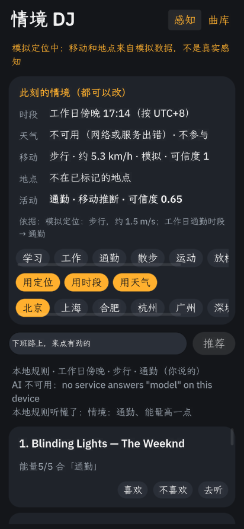
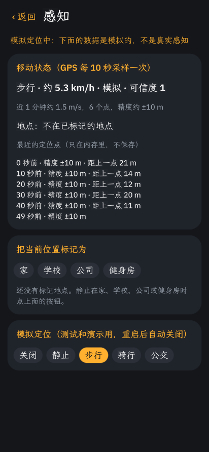

# 情境 DJ（context-dj）

一个 OctoSense 脚本应用（`bundle/main.splash`），参加 GOSIM 智能体应用黑客松 2026 的音乐赛道。

它先**自动判断你此刻在做什么**：GPS 测速得出静止、步行、骑行或乘车，再结合你标记的地点、时段和天气。然后按**情境 + 你说的一句话 + 你过去的反馈**挑一组歌，逐首说明为什么选它。每一项情境都写明来源和可信度，手动选择永远优先。

| 主页 | 感知 | 曲库 |
|---|---|---|
|  |  |  |

截图是在电脑上用模拟定位拍的，界面上有橙色的"模拟定位中"提示。v0.2 的完整设计和接口见 [docs/PLAN.md](docs/PLAN.md)。

## 设计依据

| 论文 | 在应用里对应什么 |
|---|---|
| Context-Aware Mobile Music Recommendation for Daily Activities（2012） | 按活动定目标能量，歌曲带能量、人声、情绪标签 |
| Smart-DJ（2016） | 按情境记住的个人偏好：同一首歌在"学习"和"运动"下的喜好分开记 |
| ExtraSensory（2017） | 多传感器融合推断情境的思路。平台不开放加速度计，所以改用 GPS 速度、地点、时段、天气融合，并给出可信度 |
| ContextPlay（2019） | 情境卡上每一项都写明来源，可以分别关掉；手动活动 90 分钟后失效；推测出来的明确标"推测" |
| LLM 对话式音乐推荐的用户体验（2025）、Read Between the Tracks（2026） | 用一句话说意图，由 AI（`model.complete`）理解意图、选歌、写理由，并显示它是怎么理解的 |

## 它是怎么工作的

1. **情境感知**：
   - GPS 每 10 秒采样一次，用近 60 秒的净位移估计速度，分为静止、步行、跑步或骑行、乘车四档。精度差于 50 m 的点丢弃，状态要连续两次一致才切换。
   - 你在"感知"页标记的家、学校、公司、健身房：在 200 m 以内且静止时，算作"在那儿"。
   - 时段来自设备时钟；天气来自 Open-Meteo，有定位时按当前位置查询。
   - 按优先级融合成当前活动：手动 > 你话里说明的情境 > 地点 > 移动 > 时段。每一步都写明依据和可信度。
2. **意图**：输入框里的一句话。
3. **选歌**：
   - 设备给本应用开放了 AI（`model` 权限）时，把文字形式的情境信号（不含坐标）、意图、候选歌和你的喜好分交给 AI，让它按固定格式（JSON Schema）**先判断你在做什么，再选 6 首歌并写理由**。应用会检查返回的编号是否合法；你手动选的或话里说明的情境不会被 AI 覆盖。
   - AI 不可用时，用本地规则打分：能量与活动的距离、是否人声、情绪、语种、你的反馈、"换一批"。界面会写明这次用的是哪种方式，以及本地规则从你的话里认出了哪些关键词。
4. **反馈**：喜欢 / 不喜欢会同时改变这首歌的总体分和当前活动下的分（范围 -3 到 3）。在某个活动下被标为不喜欢的歌，在这个活动下基本不会再出现。
5. **播放**：OctoSense 脚本应用没有音频播放接口，所以"去听"会在应用内网页打开网易云音乐、QQ 音乐或 B 站的搜索页，做法和系统自带的 YouTube 应用一样。
6. **应用助手**：manifest 里声明了一个只读的 agent，见 `bundle/AGENT.md`。在 OctoSense 的 "Ask 情境 DJ" 面板里，它可以根据本地的推荐历史和反馈回答"我学习时喜欢听什么"之类的问题。

## 运行与检查

需要按 [OctoScript-App-Design-Flow](https://github.com/OctoSense-org/OctoScript-App-Design-Flow/blob/main/README.zh-CN.md) 搭好的 `tools/octo`：

```sh
tools/octo run bundle --port 8141 --detach
tools/octo check bundle
```

## 验证情况

**已验证（v0.2）**：Linux（Ubuntu 24.04，Xvfb）+ App Hub `card-host` 隐藏窗口，所有操作都通过 remote bridge 真实点击和输入完成。docs/PLAN.md 第 4 节的 T1–T10 全部通过：
- 用模拟定位测了静止、步行、骑行、公交，状态切换有两次确认，不会来回跳
- 地点推断、手动覆盖、从话里识别情境
- 反馈按活动分开记
- 重启后的持久化，以及历史里不含坐标
- 0.1 版数据的迁移

**已验证（v0.1 起）**：
- 首次启动；选择活动；输入意图后推荐；喜欢和不喜欢写入 `feedback.json`；重启后反馈仍然影响排序（喜欢过的升到第一，不喜欢的消失）
- 换一批；添加和删除自己的歌；断网时天气显示"不可用"、不参与推荐，其余功能照常
- `card-host` 不提供 `model` 服务，所以每次都走了"AI 不可用 → 本地规则"这条路，并显示了原因
- `tools/octo check bundle` 的结果为 `context-dj 0.2.0 — PASSED`

**未验证**：
- 真机 GPS：目前还没有把商店应用装到手机上的途径，要等 App Hub 上架
- 真机上的 AI 选歌和 AI 补标签：只在 OctoSense Shell 里有 `model` 服务，`card-host` 里没有
- 应用内网页播放：Linux 桌面的 makepad 没有实现内置网页（`UpdateSystemBrowser` not implemented），要在 Android 或 macOS 上验证
- Open-Meteo 返回成功时的天气显示：测试环境访问不到这个地址
- 应用助手面板

内置 45 首歌的能量、人声、情绪标签是人工粗略标注的，不是测量得到的。
